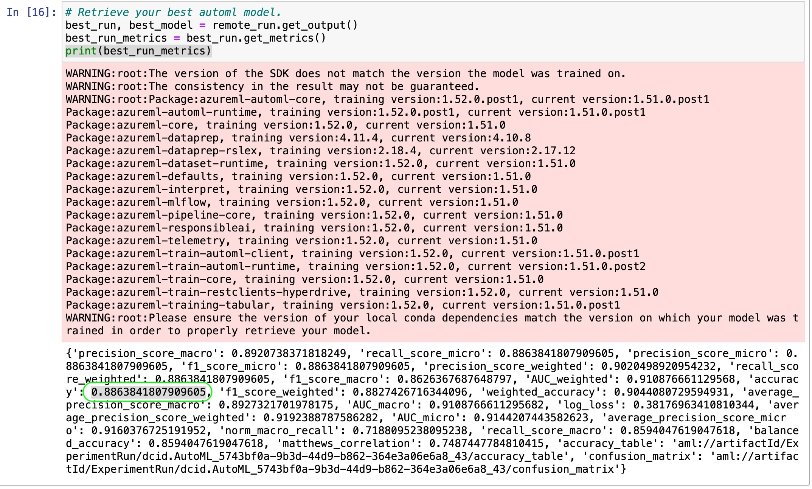

# Your Project Title Here

The objective of the project was to utilize Azure's AutoML and Hyperdrive capabilities to train various models, identify the most efficient one, and then deploy it as a web service. The final step involved evaluating the service's endpoints to determine individuals at elevated risk of cardiovascular issues, which could be due to multiple risk factors including hypertension, diabetes, hyperlipidemia, or pre-existing conditions. This approach aimed to streamline the prediction process for high-risk cardiovascular conditions.

## Project Set Up and Installation
The dataset has been downloaded from Kaggle and manually upload to Blogstorrage.

## Dataset

### Overview
The heart_failure_clinical_records_dataset.cvs was acquired from Kaggle (Dataset from Davide Chicco, Giuseppe Jurman). 
https://www.kaggle.com/datasets/andrewmvd/heart-failure-clinical-data/data

About the data
age: Age of the patient
anaemia: Haemoglobin level of patient (Boolean)
creatinine_phosphokinase: Level of the CPK enzyme in the blood (mcg/L)
diabetes: If the patient has diabetes (Boolean)
ejection_fraction: Percentage of blood leaving the heart at each contraction
high_blood_pressure: If the patient has hypertension (Boolean)
platelets: Platelet count of blood (kiloplatelets/mL)
serum_creatinine: Level of serum creatinine in the blood (mg/dL)
serum_sodium: Level of serum sodium in the blood (mEq/L)
sex: Sex of the patient
smoking: If the patient smokes or not (Boolean)
time: Follow-up period (days)
DEATH_EVENT: If the patient deceased during the follow-up period (Boolean)

### Task
The task is to determine whether a patient passed away during the follow-up period. For this purpose, we will utilize the 'DEATH_EVENT' column as our target variable. Given that 'DEATH_EVENT' is a boolean variable, indicating only two possible outcomes, our analysis falls under the category of Binary Classification. 

### Access
Open the Azure AI | Machine Learning Studio, navigate to the 'Data' section and establish a fresh dataset by uploading a CSV file from the local machine.

## Automated ML
### An overview of the `automl` settings and configuration
Create a cluster instance

the compute target that we provisioned is set with compute_target=cluster, and the number of max_concurrent_iterations of your experiment should be matched to the number of nodes in the cluster.
The argument task is set to classification since we are dealing with a binary classification and we also need to set label_column_name="DEATH_EVENT" in order to predicting DEATH_EVENT. 
The dataset should be specified in training_data=dataset.
set "primary_metric" : 'accuracy' to select the best model by Using accuracy metrix

### Results

The best performing model trained by AutoML was VotingEnsemble with Accuracy 0.88638

#### `RunDetails` widget as well as a screenshot of .

#### the best model trained with it's parameters

#### Save the best model 

#### Register The best Model

## Hyperparameter Tuning
*TODO*: What kind of model did you choose for this experiment and why? Give an overview of the types of parameters and their ranges used for the hyperparameter search

### Results
*TODO*: What are the results you got with your model? What were the parameters of the model? How could you have improved it?

#### the screenshots of the RunDetails widget

#### the best model trained with it's parameters

## Model Deployment
*TODO*: Give an overview of the deployed model and instructions on how to query the endpoint with a sample input.

#### Endpoint Details 

#### Endpoint Status 

#### Service Log 

#### 'TESTING' query the endpoint with a sample input.

## Screen Recording
*TODO* Provide a link to a screen recording of the project in action. Remember that the screencast should demonstrate:
- A working model
- Demo of the deployed  model
- Demo of a sample request sent to the endpoint and its response

## Standout Suggestions
*TODO (Optional):* This is where you can provide information about any standout suggestions that you have attempted.
